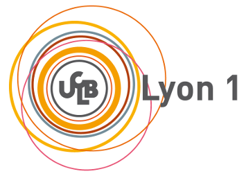

# MIF08-labs
Public files for LYON1-FST M1 students (MIF08 course)




[Official Website for MIF08 (where to find labs subjects)](https://compil-lyon.gitlabpages.inria.fr/compil-lyon/)

[La page de l'avancée du cours (fr)](./AVANCEE.md)

# Get the repository

```
git clone https://github.com/lauregonnord/mif08-labs19.git
cd mif08-labs19
```

# Contents


   * TPxx/     : student companion files for MIF labs 2019-20.


# About the target machine

The target machine is RISCV. The directory contains [instructions](https://github.com/lauregonnord/mif08-labs19/blob/master/INSTALL.md) to install a compiler and a simulator.

# Contact

Laure Gonnord, Université Lyon 1, LIP [email](mailto:laure.gonnord@univ-lyon1.fr)

# Contributors

  * Labs (ENSL 2019 version): Laure Gonnord, Matthieu Moy, Ludovic
    Henrio, Marc De Vismes.
  
